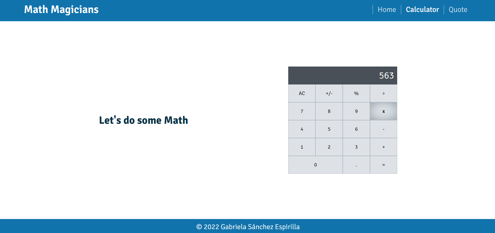

# Math Magician
It is a Single Page App (SPA) that allows users make simple calculations, and read a random math-related quote.

## Features

- It displays the user interface for a standard calculator using React components.
- It uses react router to navigate between three pages dinamically.
- It uses events and lift state up approach to update the state to all components.
- It uses useState hook to keep the state updated within functional components.

## Built With

- JavaScript
- React
- SCSS

## Live Demo

[HEROKU](https://mathmagiciansgaby.herokuapp.com/)
[NETLIFY](https://mathmagiciansgaby.netlify.app/)
[GH-PAGES](https://gabyse1.github.io/math-magicians/)

## Getting Started

To get a local copy up and running follow these simple example steps.

### Prerequisites

- Have git installed on your local computer.

### Install

- Clone this repository to your local computer. Choose the location you prefer.
- Run the command *npm install* to install all project's dependencies.

### Deployment

- Run the command line *npm run start*.
- The project will automatically open the *index.html* file in a browser.

## Authors

👤 **Gabriela Sánchez Espirilla**

- GitHub: [@gabyse1](https://github.com/gabyse1)
- Twitter: [@gabyse0](https://twitter.com/gabyse0)
- LinkedIn: [Gabriela](https://www.linkedin.com/in/gabriela-s%C3%A1nchez-espirilla-83011b225/)

## 🤝 Contributing

Contributions, issues, and feature requests are welcome!

Feel free to check the [issues page](../../issues/).

## Show your support

Give a ⭐️ if you like this project!

## Acknowledgments

- Linters: [Microverse](https://github.com/microverseinc/linters-config)

## 📝 License

This project is [MIT](./MIT.md) licensed.